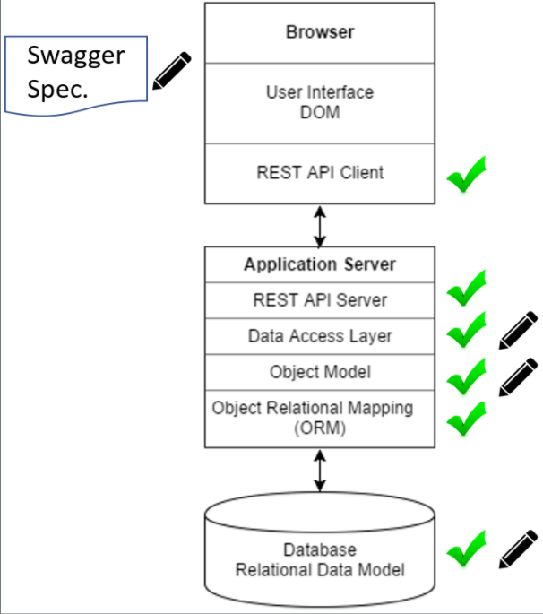

Swagger Codegen Extension
====================

# Introduction #
----------------
The Swagger Codegen Extension contains 3 code generator extensions that transform an OpenAPI specification into application code for:

- .NET Core MVC
- Java Fuse
- Python Django Rest API

All 3 code generators are intended to be used with applications deployed to OpenShift, however they are also compatible with applications deployed to traditional hosting environments.

The generated code somewhat extends the initial purpose of Swagger codegen, which was to generate the REST client and server code for a public API. The code generated with these generators are intended for use in generating the internal API of a web application - the REST interface between the front end and back end. In doing the backend code generation, the models for the code are generated, enabling the API Server Framework (e.g. .NET Core, Django, etc.) Object Relation Mapper (ORM) component (e.g. Entity-Framework for .NET Core) to generate the database model for the application.  Thus, from a swagger definition, all of the code with checkmarks can be generated:

The codegen extension is being developed as an open source solution.

Build Prerequisites
-------------
- Java 7+ JDK  https://java.com
- Maven https://maven.apache.org
- Git https://git-scm.com/

Building the Generator
------------

- Clone this repo locally
- Run `mvn package` to compile the jar file - output file is:

The resulting jar file can then be used with the Swagger.io Codegen utility.

# Project Code Generation Usage #
-----

Once you have the jar required for your project, copy several files from this project to
the place in your application project where you will generate the code. We recommend creating
a /APISpec folder in your project where you maintain the swagger file and you run the code generator.  The needed files are:

- the generated jar from the build
- extcodegen.bat (Windows) - shell version to come
- swagger-codegen-extension.json - the config file

You also need to get the swagger-codegen-cli.jar from the official Swagger Codegen project. To get the file use the [steps provided here](https://github.com/swagger-api/swagger-codegen).

Once you have downloaded the files, we recommend that you edit the extcodegen.bat and config files to set the required values for your project. The extcodegen.bat file documents the variables you can set to tune the behaviour of the generation for your project. You can use command line parameters to run the script, but that can be tedious.

There are two types of generated code from the generator:

- Code that will go "as is" into your application. This is dependent on the tech stack you are using.
- Code that you will manually update post-generation to provide application-specific behaviour.

The trick is, of course, knowing as you iterate on the API design what manual code changes are needed to address changes in the API. More on that below.

## Iterative Generation ##

On first use, you will copy most of the generated code into your application, and manually update some of the generated code.  If possible, it would be good to iterate on the API without manually updating the code until you have a significant chunk of the API completed.

As your OpenAPI (swagger) definition evolves, we recommend the following approach to code generation:

- Generate the code into a path that is NOT part of your project source code (e.g. that won't be picked up by your IDE/build mechanisms), and retain the untouched generated code from iteration to iteration. By retaining the generated code, you can diff previous versions against new versions to define what manual code changes will you need to make to your application.

- Copy the generated "as is" code (based on your tech stack) to the appropriate place in your application.

- Use diff tools to identify the changes in the API (swagger definition - yaml or json file) and the generated-but-manually maintained code to help in figuring out what changes are needed in the manually maintained code to address the changes in the API definition.

The following provides information by tech stack about generated code that can be used as is, and what code needs to be manually maintained in the application.

## Django ##

The Django generator is meant to be used to generate the skeleton for an application that uses the Django REST API libraries.  It will generate the following files:

- admin.py : Used to cause models to become database tables
- models folder : Contains definitions for database models and view models
- serializers.py : Contains serializers for the generated models
- fakedata.py : Contains basic data for testing models
- test_api_simple : Contains tests for CRUD operations on simple structures (those only containing primitive attributes)
- test_api_complex : Contains tests for CRUD operations on complex structures (those containing child objects that are not primitive).  This file will have to be edited to create child objects in the correct order.
- test_api_custom : Contains stubs for non CRUD operations.  This file will have to be edited to to implement tests.
- urls.py : Django URL routing
- views.py : Basic generated views for CRUD operations
- views_custom.py : Non CRUD views.  This file will have to be edited.

The following files will be used "as is" and so can be safely copied into the target project folder after generation:
- admin.py
- serializers.py
- models
- test_api_simple
- urls.py
- views.py

## ASP .NET Core ##

The .net core generate is intended to be used to build a .net core 1.1 MVC application.

It generates the following:
- test skeletons for the model and paths
- Application source for the following:

  - Models
  - View Models
  - Controllers
  - Service Interfaces
  - Service Implementation Skeleton
  - Database context definition, which triggers models to become database tables
  - Supporting files

The .NET Core generator does not automatically implement CRUD operations.

The files in the following folders will be used "as is" and so can be safely copied into the target project folder after generation (where "API" is updated based on your generator config.json file)

- src/API/Controllers
- src/API/Models
- src/API/ViewModels
- src/API/Services

The src/API/Services.Impl are just stubs of the necessary implementation, and these are what are needed to be manually maintained.  The following is some guidance on that:

- Diff the old and new versions of the Services.Impl folder to see what files are new and what files have been deleted when a new iteration of the API is created. Services.Impl files are generated for each path in the API, so when paths are added/removed from the swagger definition, their associated file in this folder will be added/removed. Copy the new files from the generated code into your application.
  - Use git tools for diff-ing the versions, or, before generating the code based on the new swagger definition, copy the old version to another directory and use that for the base diff.
  - For new Services.Impl files, determine the requirements of those implementations and code those changes into the corresponding files in your application.
- In the remaining Services.Impl look for diffs in the old/new versions of the generated code and apply those changes to the application code.
- Attempt to compile the application, and look for compile errors.  Correlate the location of the errors (e.g. in what file in Services.Impl) with the paths in the swagger definition and the models associated with the paths. Again, use diff-ing between the old/new swagger definition and generated code to identify the changes in the API and hence the manual code changes to be made.

## Java Fuse ##

The Java fuse generator creates a CXF / CDI FUSE skeleton that is suitable for creating a back end service or microservice.  The skeleton will run on its own however is intended to be edited to implement functionality.

The Java fuse generator creates the following:
- supporting files for a full API server
- API implementation skeleton
- Model definitions

The Java Fuse generator does not create database objects at this time.

# Swagger-Codegen-Extension Development #
-----------
The Swagger-Codegen-Extension is composed of a set of Java classes, one for each implemented tech stack.

Each implemented tech stack also has a set of Mustache templates which are used to render the code.

# Contribution #
------------

Please report any [issues](https://github.com/bcgov/Swagger-Codegen-Extension/issues).

[Pull requests](https://github.com/bcgov/Swagger-Codegen-Extension/pulls) are always welcome.

If you would like to contribute, please see our [contributing](CONTRIBUTING.md) guidelines.

Please note that this project is released with a [Contributor Code of Conduct](CODE_OF_CONDUCT.md). By participating in this project you agree to abide by its terms.

License
-------

    Copyright 2017 Province of British Columbia

    Licensed under the Apache License, Version 2.0 (the "License");
    you may not use this file except in compliance with the License.
    You may obtain a copy of the License at

       http://www.apache.org/licenses/LICENSE-2.0

    Unless required by applicable law or agreed to in writing, software
    distributed under the License is distributed on an "AS IS" BASIS,
    WITHOUT WARRANTIES OR CONDITIONS OF ANY KIND, either express or implied.
    See the License for the specific language governing permissions and
    limitations under the License.

Maintenance
-----------

This repository is maintained by [BC Ministry of Transportation](http://www.th.gov.bc.ca/).
Click [here](https://github.com/orgs/bcgov/teams/tran/repositories) for a complete list of our repositories on GitHub.
